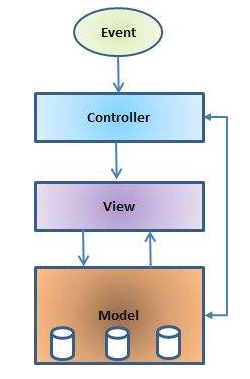
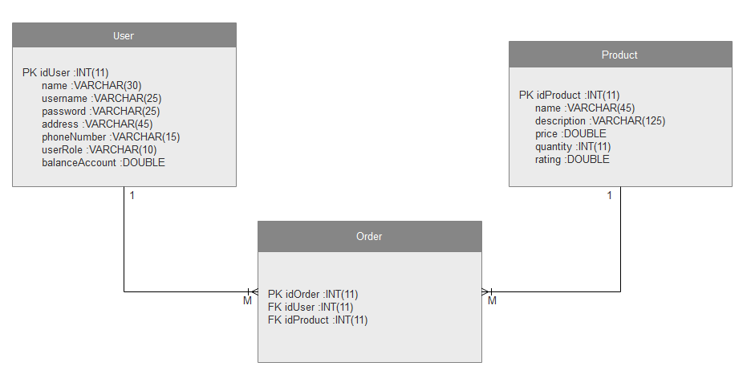
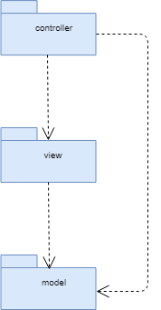
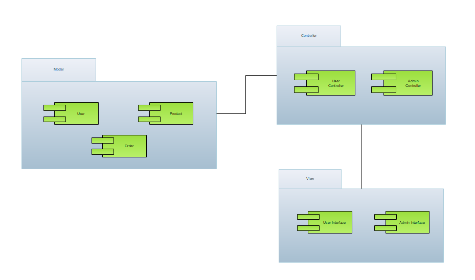

# Analysis and Design Document

# Requirement analysis

## Assignment Specification
Application description

## Function requirements
Present the functional requirements

## Non-functional Requirements
Discuss the non-functional requirements for the system

# Use-Case Model
Create the use-case diagrams and provide one use-case description (according to the format below).

# System Architectural Design

## Architectural Pattern Description

  Model View Controller (MVC) is a software design pattern for developing web applications. A MVC pattern is made up of the following three parts:

   -> Model − The lowest level of the pattern which is responsible for maintaining data.
            − This is responsible for managing the data of the application. It responds to the request from the view and it also responds to instructions from the controller to update itself.
   
   -> View − This is responsible for displaying all or a portion of the data to the user.
           − It means presentation of data in a particular format, triggered by a controller's decision to present the data.
   
   -> Controller − Software Code that controls the interactions between the Model and View.
                 − This is responsible for responding to the user input and perform interactions on the data model objects. The controller receives the input, it validates the input and then performs the business operation that modifies the state of the data model.
  MVC is popular as it isolates the application logic from the user interface layer and supports separation of concerns. Here the Controller receives all requests for the application and then works with the Model to prepare any data needed by the View. The View then uses the data prepared by the Controller to generate a final presentable response. The MVC abstraction can be graphically represented as follows.
  
  
  

## Diagrams

## Design Patterns Description
Describe briefly the used design patterns.

## UML Class Diagram

## DB Schema Diagram

## Package Diagram

## Deployment Diagram

## Component Diagram

# Data Model
Present the data models used in the system’s implementation.

# System Testing
Present the used testing strategies (unit testing, integration testing, validation testing) and testing methods (data-flow, partitioning, boundary analysis, etc.).

# Bibliography
- [Online diagram drawing software](https://yuml.me/) ([Samples](https://yuml.me/diagram/scruffy/class/samples))
- [Yet another online diagram drawing software](https://www.draw.io)
- [Layers](https://martinfowler.com/bliki/PresentationDomainDataLayering.html)
