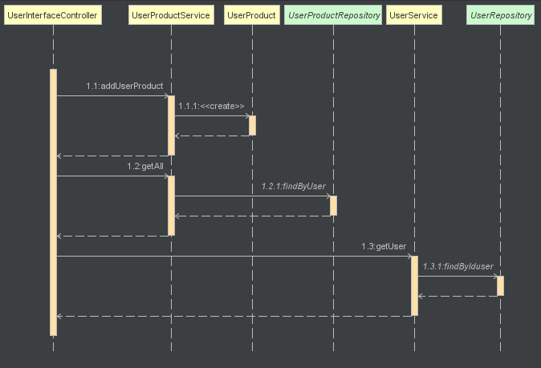
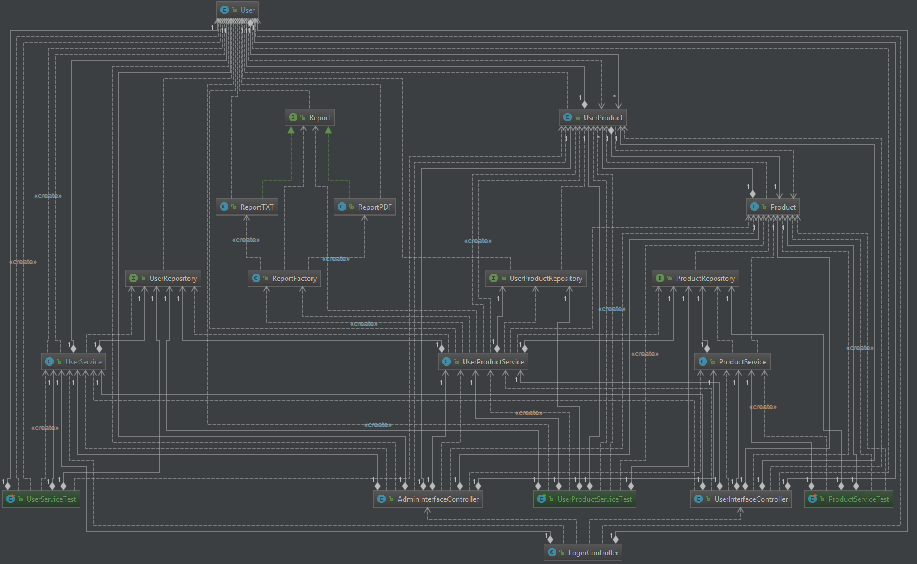
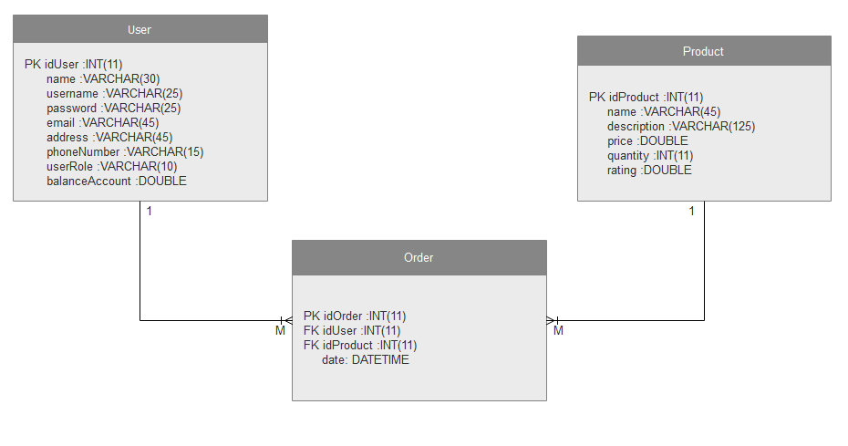
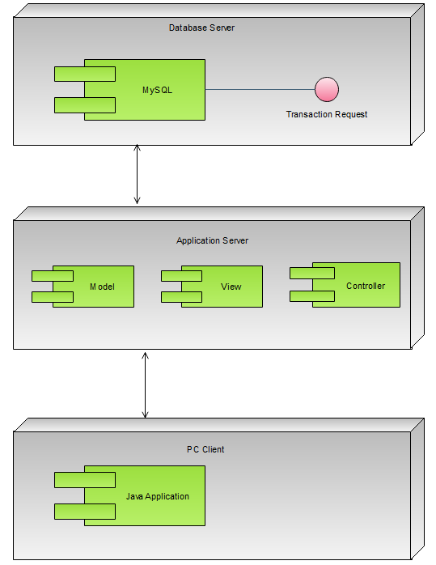

# Analysis and Design Document

# Requirement analysis

## Assignment Specification
Application description

## Function requirements
Present the functional requirements

## Non-functional Requirements
Discuss the non-functional requirements for the system

# Use-Case Model
Create the use-case diagrams and provide one use-case description (according to the format below).

## Use case 1

    * Use case: Order a product
    * Level: User Goal Use Cases
    * Primary actor: User
    * Main success scenario:
      1.	The user has an account, so he writes his username and password 
      2.	Next step, consists in the fact that the user presses the login button to enter in the application
      3.	Once logged, the user selects the product which he wants to buy, and then press the buy product button
      4.	The user has enough money and the product was bought with success
    * Extensions: alternate scenarios of success or failure>
      1 – 3. Same steps
      4. The user doesn’t have enough money, thing that means the order fails

## Use case 2

    * Use case: Create a new user
    * Level: one of: user-goal level
    * Primary actor: Admin
    * Main success scenario:
      1.	The admin completes his username and password 
      2.	Next step, consists in the fact that the admin presses the login button to enter in the application
      3.	Then the admin completes all the fields, with the data’s user (he respects all the constraints)
      4.	Then he presses the create button

    * Extensions:
      1 – 2. Same steps
      3. The admin doesn’t complete all the fields or he doesn’t respect the constraints 
      4. He presses the create button
      5. Fails

# System Architectural Design

## Architectural Pattern Description
   
## Diagrams

## UML Sequence Diagrams
Scenario: Buy a product

## Design Patterns Description
Describe briefly the used design patterns.

## UML Class Diagram

## DB Schema Diagram

## Deployment Diagram

# Data Model
Present the data models used in the system’s implementation.

# System Testing
Present the used testing strategies (unit testing, integration testing, validation testing) and testing methods (data-flow, partitioning, boundary analysis, etc.).

# Bibliography
- [Online diagram drawing software](https://yuml.me/) ([Samples](https://yuml.me/diagram/scruffy/class/samples))
- [Yet another online diagram drawing software](https://www.draw.io)
