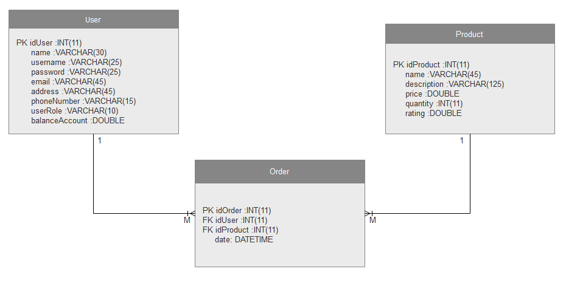

# Analysis and Design Document

# Requirement analysis

## Assignment Specification
Application description

## Function requirements
Present the functional requirements

## Non-functional Requirements
Discuss the non-functional requirements for the system

# Use-Case Model
Create the use-case diagrams and provide one use-case description (according to the format below).

# System Architectural Design

## Architectural Pattern Description

## Diagrams

## Design Patterns Description

  Observer pattern is used when there is one-to-many relationship between objects such as if one object is modified, its depenedent objects are to be notified automatically. Observer pattern falls under behavioral pattern category.
 
  Observer pattern uses three actor classes. Subject, Observer and Client. Subject is an object having methods to attach and detach observers to a client object. We have created an abstract class Observer and a concrete class Subject that is extending class Observer.
  
  An example of using the observer design pattern is to use it to solve the following feature: "notify a client if a product is in his favorite products list"

## UML Class Diagram

## DB Schema Diagram

## Package Diagram

## Deployment Diagram

## Component Diagram

## Sequence Diagram

# Data Model
Present the data models used in the system’s implementation.

Data models provide a framework for data to be used within information systems by providing specific definition and format. If a data model is used consistently across systems then compatibility of data can be achieved. If the same data structures are used to store and access data then different applications can share data seamlessly. The results of this are indicated in the diagram.

My application has 3 types of data: user, product and order (userProduct). Between user and order, and, between product and order are one-to-many relations.

# System Testing
Present the used testing strategies (unit testing, integration testing, validation testing) and testing methods (data-flow, partitioning, boundary analysis, etc.).

# Bibliography
- [Online diagram drawing software](https://yuml.me/) ([Samples](https://yuml.me/diagram/scruffy/class/samples))
- [Yet another online diagram drawing software](https://www.draw.io)
- [Layers](https://martinfowler.com/bliki/PresentationDomainDataLayering.html)
